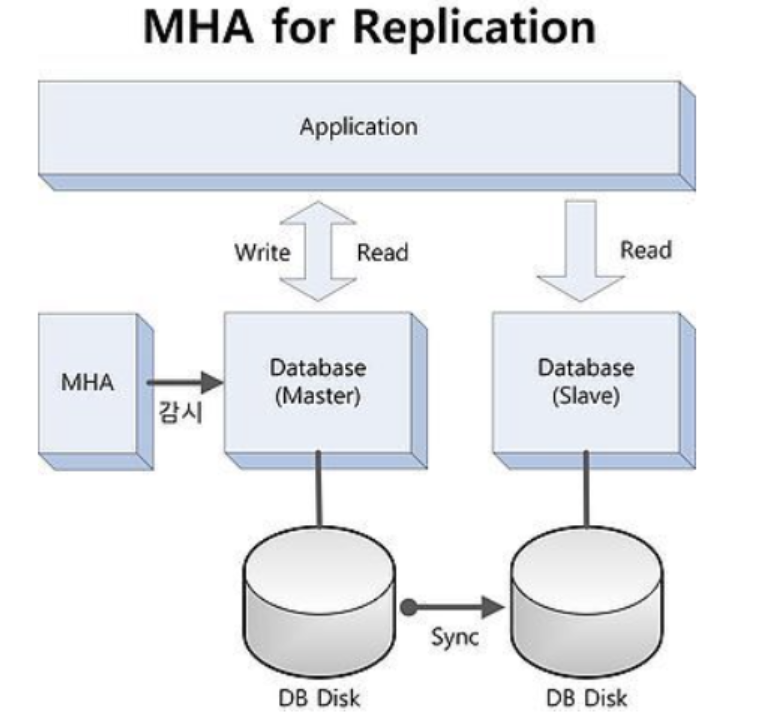

# MySQL-Primary-Replica toy project

### DB Master : 메인 프로세스 담당
### DB Slave : Master를 보조하는 Slave로 메인 프로세스 이외의 잡일 담당

## 역할 정리

### 1) DB 트래픽 분산일때
#### DB Master : 데이터의 변경( INSERT, UPDATE, DELETE )
#### DB Slave : 데이터 읽기 (SELECT)

### 2) 백업
#### DB Master : 데이터 원본 서버
#### DB Slave : 백업서버

## 장애 발생
### 1) Slave 일부가 죽었을 경우
#### Replication Driver에서 자동으로 감지하고 살아있는 다른 슬레이브로 데이터 요청쿼리를 보낸다.
#### DB 접속을 공인 아이피로 통신할 지라도 접속 지연 현상은 발생하지 않는다.
### 2) Slave가 모두 죽었을 경우
#### Master와만 통신이 가능할 뿐 슬레이브와는 통신이 불가하다.
#### 슬레이브 DB가 정상적으로 돌아오게 되면 자동으로 상태가 복구된다.
### 3) Master 죽었을 경우
#### 슬레이브가 멀쩡하게 살아있는데도 데이터를 읽을 수가 없음
#### → 전체 서비스 마비
#### 마스터 서버를 복구하였다 할 지라도, 서비스가 정상적으로 돌아오지 않음.
#### → 데이터 유실

## Master 죽었을 경우에 대비하여 대처 방법
## MHA (Master High Availability)

### Master DB가 장애로 서비스가 불가능한 상태가 되면,  자동으로 failover를 수행하여 slave DB(가장 최신의 데이터가 동기화된)를 master DB로 승격시켜 서비스 다운타임을 최소화 auto failover 솔루션이다.
### MHA Manager, Masrer, Slave 서버 총 3개가 기본 구성이며 상황에 따라서는 1개의 Master와 N개의 Salve 최소 2대 까지 사용할 수 있다.
### 서비스가 동작안하는 다운 타임을 최소로 한다.
### Master의 장애로 각 노드(Master 및 Slave)의 데이터 불일치가 발생하지 않는다. MHA Monitor가 Master의 Binary Log와 Slave들의 Relay Log를 확인하여 DB 간의 차이나는 쿼리를 DB에 반영 ( Master의 변경 기록 확인 )

